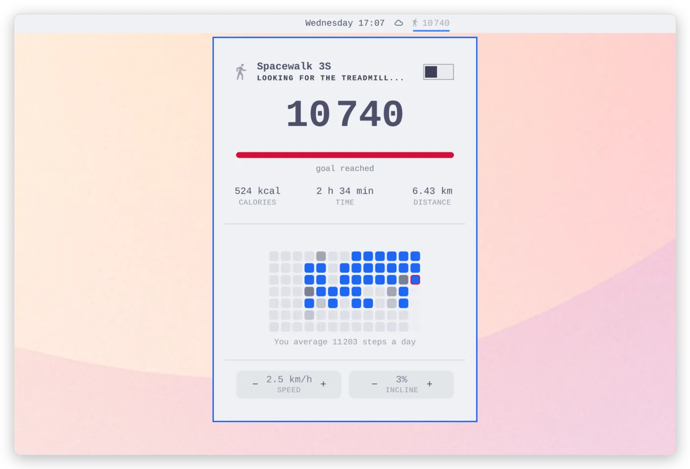

# Spacewalk

Walk while you work, without the vendor app. Spacewalk drives a **Urevo
SpaceWalk 3S** walking pad from the [Omarchy](https://omarchy.org) bar: today's
steps with a progress bar toward your daily goal in the bar, and a panel with
calories, time, distance, an estimated goal time, a day-by-day history grid,
and speed / incline / belt control.

<picture>
  <source media="(prefers-color-scheme: dark)" srcset="docs/hero-dark.webp">
  
</picture>

## Supported treadmills

Developed and verified against the **Urevo SpaceWalk 3S**. The treadmill side
is standard Bluetooth FTMS (Fitness Machine Service, `0x1826`), so any
FTMS-speaking pad should largely work: speed, incline (when the machine has
it), distance, calories and time are all plain FTMS. The step counter is the
one vendor-specific part — the SpaceWalk 3S publishes its own step count in a
spare corner of the FTMS packet ([docs/gatt-dump.md](docs/gatt-dump.md)); on
other pads set `strideMeters` and steps are derived from distance instead.

Got a **KingSmith WalkingPad**? Two good plugins already cover it — use one
of those instead:
[msegoviadev/omarchy-walkingpad](https://github.com/msegoviadev/omarchy-walkingpad)
(steps, daily goal and a contribution graph; speaks the legacy WiLink protocol
as well as FTMS, so it covers the A1/C1/C2/R1/S1 generation too) and
[shllg/omarchy-walkingpad-control](https://github.com/shllg/omarchy-walkingpad-control)
(belt control with charts and a history browser, measured against a C2).

If you have some other FTMS pad and it works — or nearly works — open an
issue and say which one; that's how the list above grows.

## Requirements

- Omarchy (the `omarchy-shell` Quickshell bar).
- `python-bleak` for the Bluetooth bridge: `sudo pacman -S python-bleak`.
  Everything else (Python, BlueZ) is already part of an Omarchy install.

Everything runs locally as your user: no cloud, no account, no telemetry, and
nothing asks for root.

## Install

```bash
sudo pacman -S python-bleak
omarchy plugin add https://github.com/ncr/omarchy-spacewalk.git --enable
```

Then add the **Spacewalk** widget to the bar from the shell's widget settings
(Setup > Plugins). Power-cycle the treadmill so it advertises, and the widget
picks it up.

## How it works

Two parts talk over a stream of JSON, one line per update:

- `spacewalk-bridge.py` — owns the Bluetooth link to the treadmill (FTMS),
  writes state to stdout, reads commands from stdin.
- `Service.qml` / `BarWidget.qml` / `Panel.qml` — the shell plugin. The
  service starts with your session and counts steps all day, panel open or not.

The day's total lives in `~/.local/state/omarchy-spacewalk/YYYY-MM-DD.json`.
The treadmill resets its own counters on every start, so the bridge adds up
increments — several walks a day sum into one number, and only midnight resets
it.

## Finding the treadmill

The treadmill must be powered, and the **Urevo phone app closed** — the pad
accepts one connection at a time. While you use this plugin, keep Bluetooth
off on the phone; the app wins the race for the connection otherwise.

```bash
./probe.py                               # scan: looks for an FTMS device
./probe.py --address XX:XX:XX:XX:XX:XX   # full characteristic dump + notification sniffing
```

Put the address into the widget's settings (Setup > Plugins), or straight
into `~/.config/omarchy/shell.json` under the `io.github.ncr.spacewalk`
entry. An empty address means "scan for FTMS on every connect" — works, but
adds a dozen seconds to each start.

## Settings

| Key | Default | Meaning |
|------|-----------|-----------|
| `address` | empty | the treadmill's Bluetooth address |
| `dailyGoal` | 10000 | daily goal in steps |
| `startSpeed` | 2.5 | speed applied after start (km/h) |
| `startIncline` | 3 | incline applied after start (%) |
| `strideMeters` | 0 | stride length; > 0 derives steps from distance for pads without a step counter |
| `phonePort` | 0 | port of the Apple Health sync server; 0 keeps it off |

## Using it

- Click the pill — the panel.
- Middle-click the pill — start or stop the belt.
- In the panel: arrows next to speed (0.5 km/h steps) and incline (1% steps),
  Start / Stop, and a history grid — hover a day to see its numbers.

Only midnight resets the day counter. The treadmill clears its own counters
when it stops, and pauses itself when you step off the belt — neither touches
the day total, because the bridge sums increments and recognizes a counter
reset. Start resumes a paused belt the same way it starts a fresh walk.

With the belt stopped the panel shows the **values to be applied on start** —
a standing treadmill reports zeros and takes no commands, so the arrows
remember your target and the bridge applies it once the belt is up to speed.

## When it stops connecting

The SpaceWalk 3S can be moody about reconnecting. The bridge retries by
itself, every 5 s at first, then every 30 s after ten misses. When that is not
enough:

```bash
bluetoothctl disconnect <address>
pkill -f spacewalk-bridge.py        # the service brings the bridge back up in ~10 s
```

You can also run the bridge by hand and watch what it says:

```bash
python3 ~/.config/omarchy/plugins/io.github.ncr.spacewalk/spacewalk-bridge.py --address <address>
```

Commands go to its stdin: `start`, `stop`, `pause`, `speed 2.5`, `incline 3`,
`reset-day`, `ping`.

## The treadmill goes to sleep

The pad only advertises for a short while after power-on. The bridge scans
continuously and grabs it the moment it speaks up, but if that window is
missed, flip the power switch.

## Apple Health

Walks can flow into Health on an iPhone via Shortcuts — the bridge serves
them on your Tailscale address when `phonePort` is set (8787 is the usual
choice). Setup: [docs/apple-health.md](docs/apple-health.md).

## Hacking on it

After changing plugin files: **`omarchy-restart-shell`**. Saving a file
reloads the bridge, but not the widget or panel QML — that needs the shell
restart. (`omarchy-refresh-shell` is something else: it restores the default
bar and wipes your widget layout — don't.)

Peek inside from a terminal:

```bash
omarchy-shell spacewalk dump      # link state and the day's counters
omarchy-shell spacewalk start     # same as Start in the panel
omarchy-shell spacewalk stop
```

## Who this is for

Honestly — I built this for my own desk and don't expect anyone else to run
it, though maybe one or two people with the same pad will turn up. If that's
you, or you just enjoy this kind of thing, follow me on
[X](https://x.com/JacekBecela) — more of it coming.

## License

[MIT](LICENSE)
